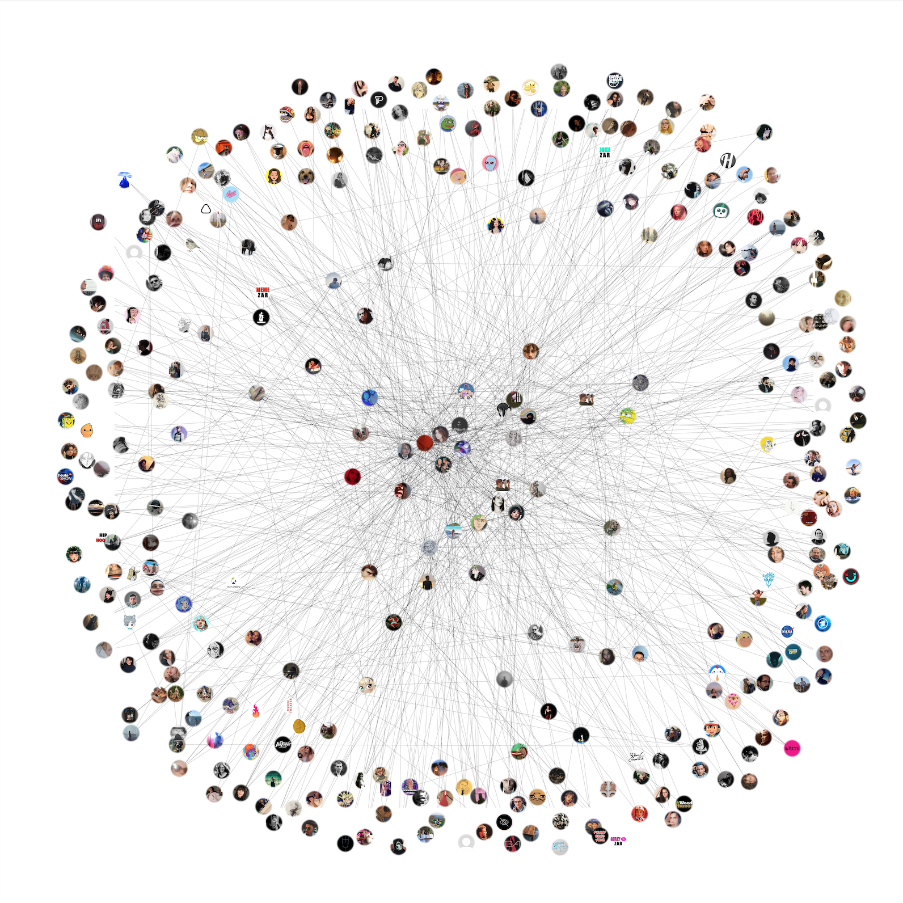
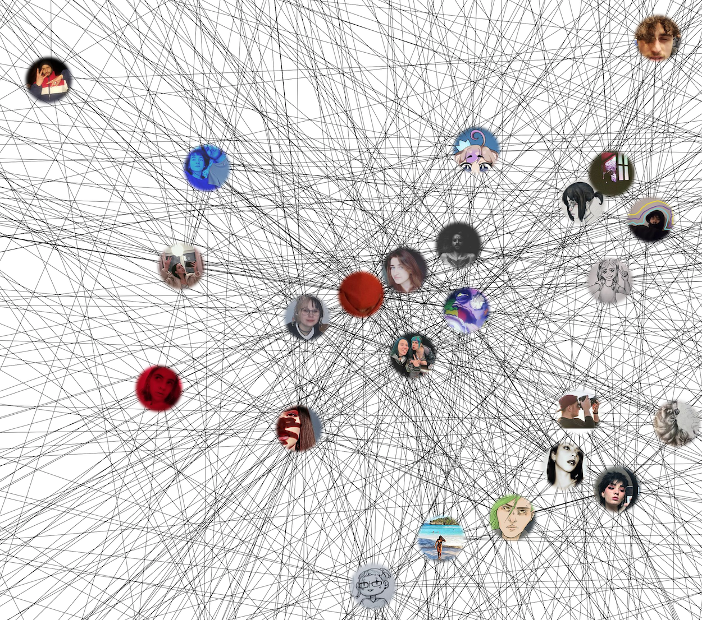

# InstagramRelationshipAnalytics

## Disclaimer

This is a reupload of a project I finished implementing in 2019 and most likely does not work anymore. 
Furthermore there are many aspects, not only code-wise but also in terms of software architecture and query design, that could be
significantly improved. 
Reflecting on the project now, I recognize opportunities to enhance the coding style by adhering
to current guidelines and best practices. 
While this project may no longer be functional, it remains a cool testament to the progress I've made. It serves as a
reminder of where I started and how far I've come. Every project, even those with flaws, contributes to the continuous
learning and growth inherent in the world of software development.

## General Info

This Tool helps scrape follower/followings from any public instagram user and displays their connection to each other.
 
I am using my own fork of the <a href="https://github.com/Dominik-CH/instagram-scraper">instagram-scraper library</a> to
get: 

 Main User | Dependent 
-----------|-----------
 Follower  | Following 
 Follower  | Follower  
 Following | Following 
 Following | Follower  

You are able to set how many followers/following you want to scrape from each individual account. 
These users and their followers/followings are stored in an SQLite Database. 
 The graph is then processed with the help of networkx and displayed using matplotlib. 
You can also specify a threshold that each user in the database has to have at least a certain amount of edges to be
part of the graph, to filter out irrelevant accounts. 
Pictures are being downloaded and saved - to make the graph look more appealing for the enduser - only if the threshold
is met.

## Dependencies

 Package                                                                      | Version 
------------------------------------------------------------------------------|---------
 Pillow                                                                       | 7.0.0   
 networkx                                                                     | 2.4     
 matplotlib                                                                   | 3.1.2   
 <a href="https://github.com/Dominik-CH/instagram-scraper">IGscraper Fork</a> | 0.3.2   

## Example Graph using <a href="https://www.instagram.com/der_ziz/">Der_Ziz</a>

Exported Graph:  
 
  
Zoomed in to be able to see the edges more cleary:
  
 

## Relationship Analytics Tool in action

