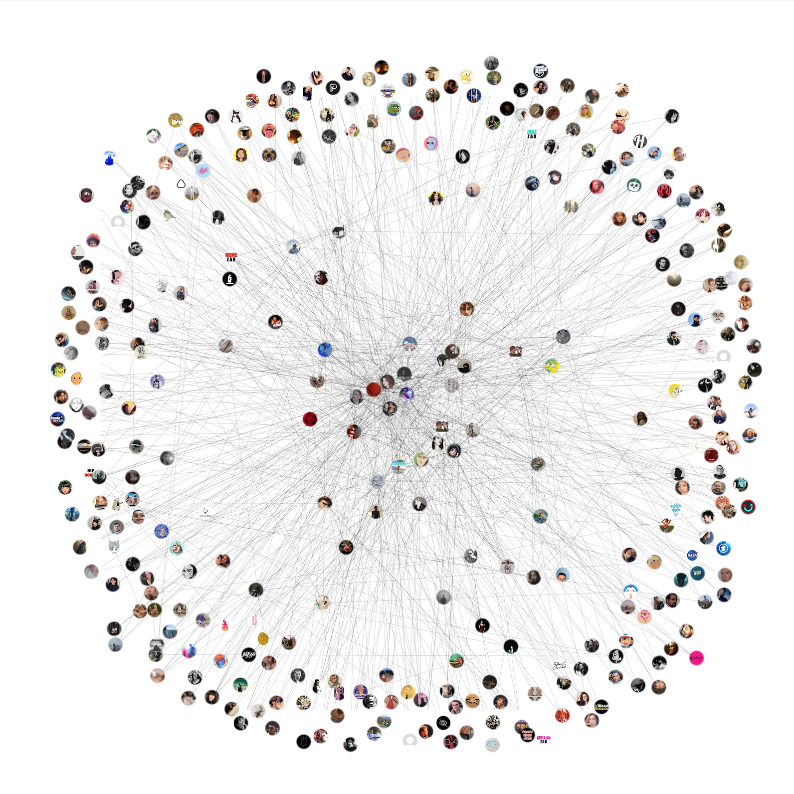
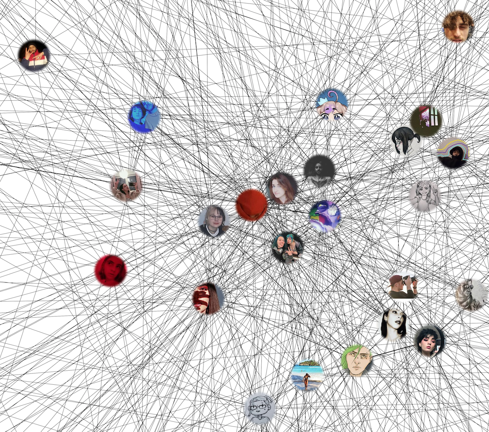

# InstagramRelationshipAnalytics

## General Info
This Tool helps scrape follower/followings from any public instagram user and displays their connection to each other.
 
I am using my own fork of the <a href="https://github.com/Dominik-CH/instagram-scraper">instagram-scraper library</a> to get: 
Main User | Dependent 
---------|----------
Follower | Following 
Follower | Follower
Following | Following
Following | Follower 

You are able to set how many followers/following you want to scrape from each individual account. 
These users and their followers/followings are stored in an SQLite Database. 
 The graph is then processed with the help of networkx and displayed using matplotlib. 
You can also specify a threshold that each user in the database has to have at least a certain amount of edges to be part of the graph, to filter out irrelevant accounts. 
Pictures are being downloaded and saved - to make the graph look more appealing for the enduser - only if the threshold is met.

## Example Graph using <a href="instagram.com/der_ziz">Der_Ziz</a>

Exported Graph: 
 
  
 

## Relationship Analytics Tool in action

